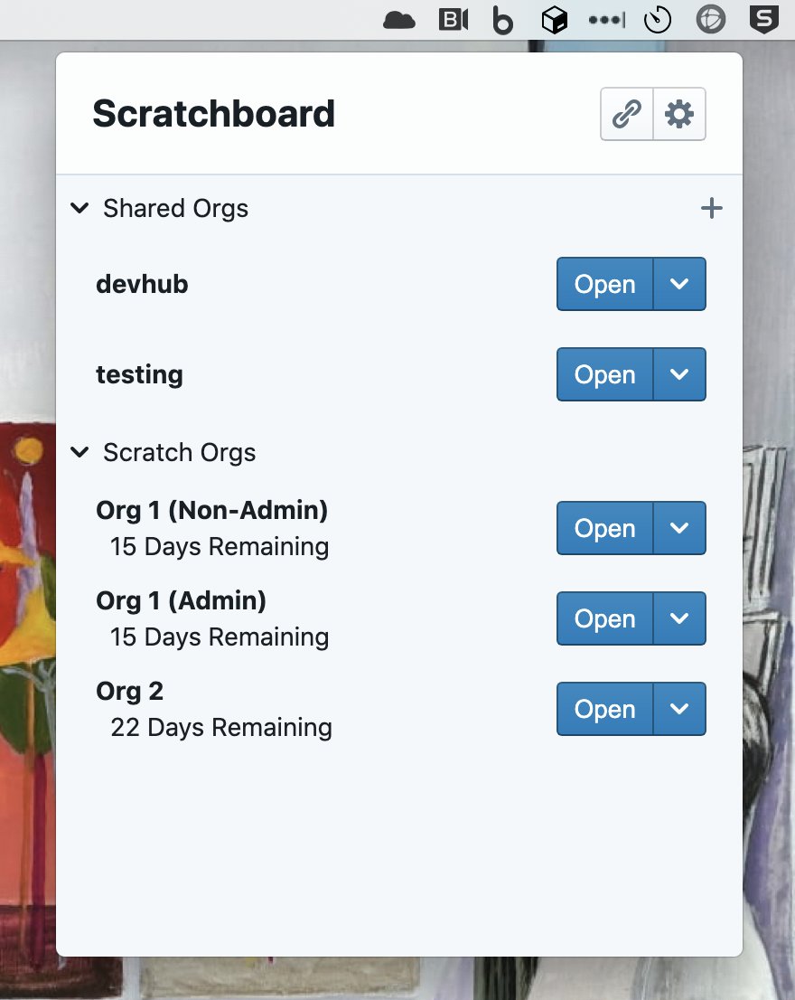

<h1 align="center">
  Scratchboard
</h1>

<h4 align="center">A tray app to make org management easier than ever, built with <a href="http://electron.atom.io" target="_blank">Electron</a>, <a href="https://blueprintjs.com/" target="_blank">BlueprintJS</a> and <a href="https://github.com/forcedotcom/sfdx-core">sfdx-core</a>.</h4>

  <a href="#motivation">Motivation</a> •
  <a href="#features">Features</a> •
  <a href="#download">Download</a> •
  <a href="#setup">Setup</a>

## Motivation

* To make it easier to track and manager your salesforce orgs with a sfdx-core based tray application.
* People can forget that a scratch org will soon expire and an active reminder could be useful.

## Features

* Tray Based
  - Lives in your computer tray for quick access.
* Supports both scratch orgs and standard orgs
* SFDX Actions
  - Open Orgs
  - Set Aliases
  - Copy Frontdoor
  - Delete Orgs (Scratch orgs only)
  - Logout of Orgs (NonScratch orgs only)
  - Login to orgs
  - Convert an arbitrary salesforce url into a frontdoor url.
  - More to come...
* Quickly see days until org expiration.
* Automaticly stays in sync with sfdx with no need to manually refresh org list.
* Dark/Light mode
* Automatically Download and Install Updates
* OS Support
  - Macos and Windows
  - Linux support planned

## Download

You can download the latest version of Scratchboard [here](https://github.com/gabriel-keith/scratchboard-tray/releases/).